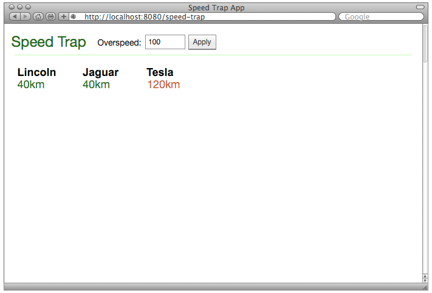
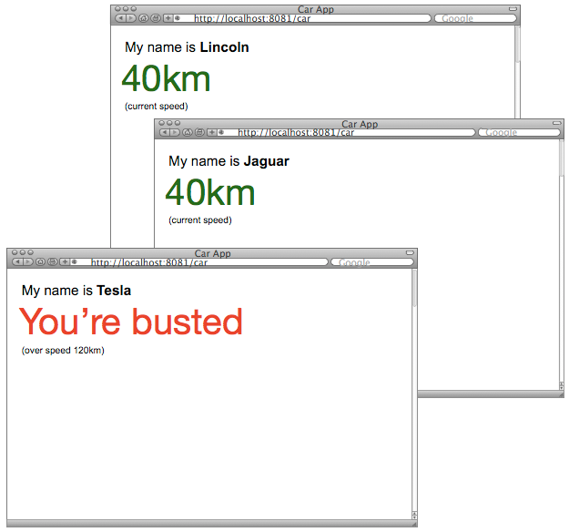

# Speed Trapper Application

Have you ever facinated to become [Terminator 2: Judgment Day](http://en.wikipedia.org/wiki/Terminator_2:_Judgment_Day) movie fame T-1000. Keep reading.


You're a cop from [SkyNet](http://en.wikipedia.org/wiki/Skynet_(Terminator\)) (pretend yourself as [T-1000](http://en.wikipedia.org/wiki/T-1000) for a moment and don't ask why T-1000 has to be in cop form) and you're tasked to trap speed of cars that are speeding above X kilometer speed.

Oh! you're also a programmer, what would you do? Yes, you would write a prototype first to see how you can trap speed of cars.

To keep things simple, Mr. T-1000 (don't you already?) we would develop two web applications a) an app to track speed of cars and bust them when they overspeed b) an app to simulate a car so that we can run more cars that would send speed details to speed tracking app. Before we go too much into details, let's quickly see what tech stuffs you need in order to build this app. If you knew following keywords ignore bullets, jump onto next paragraph. Otherwise, take a break and quickly read links provided below

1. [SignalR](http://signalr.net/) - a C# based framework that can send quick signals to various browser sessions.
2. [jQuery](https://jquery.org/) - a JS framework, made JavaScript reachable to poor people.
3. [C#](http://en.wikipedia.org/wiki/C_Sharp_\(programming_language\)) - obviously, you must be knowing what it is.
4. [ASP.NET MVC 5](http://en.wikipedia.org/wiki/ASP.NET_MVC_Framework) - a web application framework makes web apps development a breeze.

## Speed Trapper



Above design shows how you observe speeds of cars while you sip cup of coffee sitting in Skynet office. Each number represents current speed of cars speeding in some roads. We don't care about which road a car is currently being driven. Each car has some name, you may find the names funny, we will come to that part little later.

The text box in the top row tells you the speed that you define as "Overspeed". Any number less than 200km should be allowed in the text box.

Let's call this app as "Speed Trapper" app since it traps speed of cars and tells you based on your Overspeed setting. Assume this app lives in URL - http://localhost:8080/speed-trapper/

## Speeding Cars

Now Speed Trapper needs to receive speeds of cars. We will have a separate web application, let's call as "Car" app, lives in URL - http://localhost:8081/car.



Above screenshot shows how Car app would look like, it just displays a random number between 10 - 200 that is assumed to be the speed of the car. The car is nothing but your browser session. So if you open more browsers, you have more cars generating random numbers. This numbers, using SignalR, would be sent to Speed Trapper application. We will leave the details to you on how you would make the communication work.

The screenshot shows names for each car. We have kept ```names.txt``` file for your reading pleasure, it has readable names that you would need to randomnly pick and assign to new browser sessions a.k.a new cars. However, do not worry about duplicate car names appearing in browser sessions.

## Making Speed Trapper and Car app talk

Once the Car app starts sending the data to Speed Trapper app. Speed Trapper now would receive the speed values (the random numbers). Speed Trapper now would check numbers to see if it is more than Overspeed thresold. In case, the number is greater than Overspeed thresold, Speed Trapper sends a SignalR message "You're busted". Car app now shows the message and stops sending random numbers, pretending, the car has been busted.

# Submission

First of all, you would need to fork this repo. You get 

#### Thanks
1. T-1000 image taken from Fast company
2. 